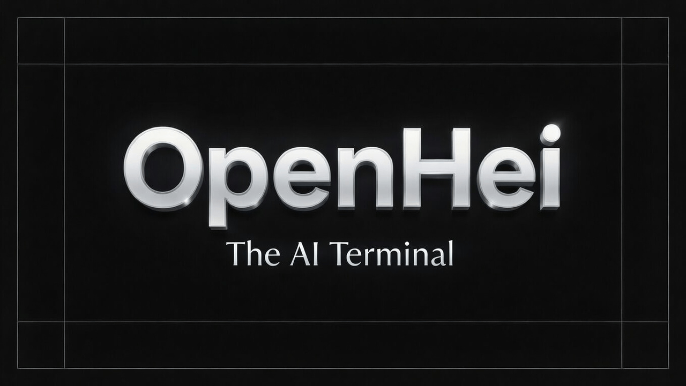

<p align="center">
  <a href="https://openhei.ai">
    
  </a>
</p>

<p align="center">The open-source AI terminal for coding, debugging, and shipping.</p>

<p align="center">
  <a href="https://openhei.ai/discord"></a>
  <a href="https://www.npmjs.com/package/openhei-ai"></a>
  <a href="https://github.com/heidi-dang/openhei/actions/workflows/publish.yml"></a>
</p>

<p align="center">
  <a href="README.md">English</a> |
  <a href="README.zh.md">简体中文</a> |
  <a href="README.zht.md">繁體中文</a> |
  <a href="README.ko.md">한국어</a> |
  <a href="README.de.md">Deutsch</a> |
  <a href="README.es.md">Español</a> |
  <a href="README.fr.md">Français</a> |
  <a href="README.it.md">Italiano</a> |
  <a href="README.da.md">Dansk</a> |
  <a href="README.ja.md">日本語</a> |
  <a href="README.pl.md">Polski</a> |
  <a href="README.ru.md">Русский</a> |
  <a href="README.bs.md">Bosanski</a> |
  <a href="README.ar.md">العربية</a> |
  <a href="README.no.md">Norsk</a> |
  <a href="README.br.md">Português (Brasil)</a> |
  <a href="README.th.md">ไทย</a> |
  <a href="README.tr.md">Türkçe</a> |
  <a href="README.uk.md">Українська</a> |
  <a href="README.bn.md">বাংলা</a>
</p>

---

## Install

```bash
# One-line install
curl -fsSL https://openhei.ai/install | bash

# Package managers
npm i -g openhei-ai@latest  # or bun/pnpm/yarn
brew install anomalyco/tap/openhei
```

## Local dev (from this repo)

```bash
# Install OpenHei from the local repo
./install.sh -repo-local --no-modify-path

# Fast reruns
./install.sh -repo-local --reuse-build --skip-install --skip-build --no-modify-path

# Symlink install
./install.sh -repo-local --reuse-build --skip-install --skip-build --no-modify-path --link

# Benchmark installer performance
./scripts/bench-install.sh
```

### Run the backend + app locally

```bash
# Backend (API) from packages/openhei
bun run --cwd packages/openhei --conditions=browser ./src/index.ts serve --port 4096

# App (dashboard) from packages/app
bun run --cwd packages/app dev -- --port 4444
```

Open `http://localhost:4444`.

## Themes

Pick a theme in Settings → Appearance → Theme. This repo includes built-in themes, including `Grok`.

## Agents

OpenHei includes two built-in agents you can switch between with the `Tab` key.

- **build** - Default, full-access agent for development work
- **plan** - Read-only agent for analysis and code exploration
  - Denies file edits by default
  - Asks permission before running bash commands
  - Ideal for exploring unfamiliar codebases or planning changes

Also included is a **general** subagent for complex searches and multistep tasks.
This is used internally and can be invoked using `@general` in messages.

Learn more about [agents](https://openhei.ai/docs/agents).

## Docs

For more info on how to configure OpenHei, [**head over to our docs**](https://openhei.ai/docs).

## Contributing

If you're interested in contributing to OpenHei, please read our [contributing docs](./CONTRIBUTING.md) before submitting a pull request.

## Building On OpenHei

If you are working on a project that's related to OpenHei and is using "openhei" as part of its name, for example "openhei-dashboard" or "openhei-mobile", please add a note to your README to clarify that it is not built by the OpenHei team and is not affiliated with us in any way.

## FAQ

#### How is this different from Claude Code?

It's very similar to Claude Code in terms of capability. Here are the key differences:

- 100% open source
- Not coupled to any provider. Although we recommend the models we provide through [OpenHei Zen](https://openhei.ai/zen), OpenHei can be used with Claude, OpenAI, Google, or even local models. As models evolve, the gaps between them will close and pricing will drop, so being provider-agnostic is important.
- Out-of-the-box LSP support
- A focus on TUI. OpenHei is built by neovim users and the creators of [terminal.shop](https://terminal.shop); we are going to push the limits of what's possible in the terminal.
- A client/server architecture. This, for example, can allow OpenHei to run on your computer while you drive it remotely from a mobile app, meaning that the TUI frontend is just one of the possible clients.

---

**Join our community** [Discord](https://discord.gg/openhei) | [X.com](https://x.com/openhei)
